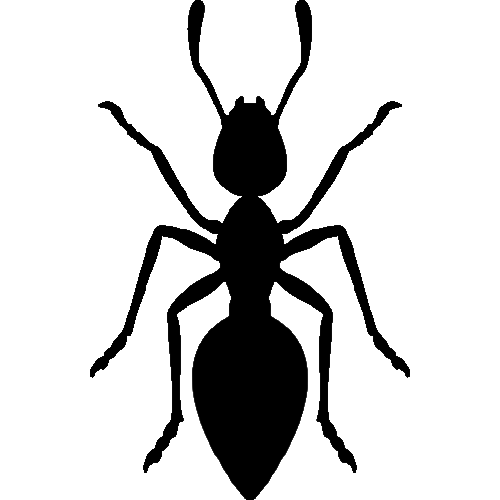

[![shiny][shiny-shield]][shiny-url]
[![Lifecycle][lifecycle-shield]][lifecycle-url]
[![MIT License][license-shield]][license-url]


<!-- PROJECT LOGO -->
<br />
<p align="center">
  <a href="https://github.com/FelixBehne/ant-colony-optimization">
    
  </a>

  <h3 align="center">Ant Colony Optimization</h3>

  <p align="center">
    A Shiny Dashboard for showing the functionality of the ant
    colony optimization algorithm.
    <br />
    <a href="https://github.com/FelixBehne/ant-colony-optimization/tree/master/man"><strong>Explore the docs »</strong></a>
    <br />
    <br />
    <a href="https://felixbehne.shinyapps.io/ant-colony-optimization/">View Demo</a>
    ·
    <a href="https://github.com/FelixBehne/ant-colony-optimization/issues">Report Bug</a>
    ·
    <a href="https://github.com/FelixBehne/ant-colony-optimization/issues">Request Feature</a>
  </p>
</p>


<!-- TABLE OF CONTENTS -->
<details open="open">
  <summary>Table of Contents</summary>
  <ol>
    <li>
      <a href="#about-the-project">About The Project</a>
      <ul>
        <li><a href="#built-with">Built With</a></li>
      </ul>
    </li>
    <li>
      <a href="#getting-started">Getting Started</a>
      <ul>
        <li><a href="#prerequisites">Prerequisites</a></li>
        <li><a href="#installation">Installation</a></li>
      </ul>
    </li>
    <li><a href="#license">License</a></li>

  </ol>
</details>


<!-- ABOUT THE PROJECT -->
## About The Project

[![Product Name Screen Shot][product-screenshot]](")

This dashboard was created as part of a programming project at the [DHBW Ravensburg](https://www.ravensburg.dhbw.de/startseite).
The task was to create a dashboard to illustrate a metaheuristic algorithm, in this case the Ant Colony Optimisation algorithm.

### Built With

* [golem](https://github.com/ThinkR-open/golem)
* [shiny](https://shiny.rstudio.com/tutorial/)
* [bs4Dash](https://rinterface.github.io/bs4Dash/)
* [shinyWidgets](https://github.com/dreamRs/shinyWidgets)
* [shinyalert](https://github.com/daattali/shinyalert)
* [shinycssloaders](https://github.com/daattali/shinycssloaders)
* [waiter](https://github.com/JohnCoene/waiter)
* ...


<!-- GETTING STARTED -->
## Getting Started

### Installation

1. Clone the repo
   ```sh
   git clone https://github.com/FelixBehne/ant-colony-optimization
   ```
2. Run inst/dependencies.R file to install all required dependendies

3. Run golem app 
   ```
   # R console 
   golem::run_dev()
   ```


<!-- LICENSE -->
## License

Distributed under the MIT License. See `LICENSE` for more information.


<!-- CONTACT -->
## Authors 

* Sarah Engelmayer 
* Markus Koch 
* Moritz Link 
* Felix Behne


<!-- MARKDOWN LINKS & IMAGES -->
<!-- https://www.markdownguide.org/basic-syntax/#reference-style-links -->
[shiny-shield]: https://img.shields.io/badge/Shiny-shinyapps.io-blue?style=flat&labelColor=white&logo=RStudio&logoColor=blue
[shiny-url]: hhttps://felixbehne.shinyapps.io/ant-colony-optimization/
[lifecycle-shield]: https://img.shields.io/badge/lifecycle-experimental-orange.svg
[lifecycle-url]: https://lifecycle.r-lib.org/articles/stages.html#experimental
[license-shield]: https://img.shields.io/github/license/felixbehne/ant.colony.optimization.svg?style=flat
[license-url]: https://github.com/FelixBehne/ant.colony.optimization/blob/master/LICENSE.md
[product-screenshot]: inst/app/www/img/product-screenshot.png
