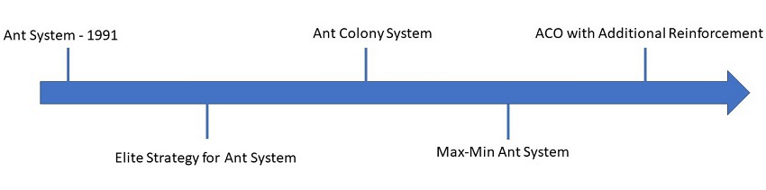

### Geschichte

Das Verhalten der Ameisen bei der Futtersuche wurde schon 1940 von Richard P. Feynman untersucht. 
Ant System wurde dann 1991 entwickelt und darauf folgten dann weitere Ant-Algorithmen.

