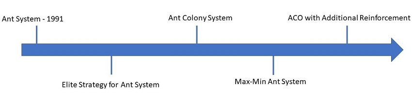
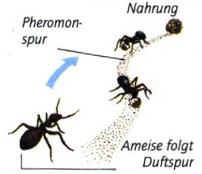

### Einordnung

>>>heuristische Optimierung..
 
>>>randomisiert
 
>>>Schwarmintelligenz...
 

### Geschichte

>>> Das Verhalten der Ameisen bei der Futtersuche wurde schon 1940 von Richard P. Feynman untersucht. 
>>> Ant System wurde dann 1991 entwickelt und darauf folgten dann weitere Ant-Algorithmen. 

### Arten von Ameisenalgorithmen

>>> 1.	Ant System
2.	Ant Colony System
3.	Ant System mit „Elitist Strategy“
4.	Ranke Based Version von Ant System
5.	Hybrid Ant System
6.	Max-Min Ant System
7.	Approximate Nondeterministic Tree Search
8.	Fast Ant System

### Herkunft 

>>> Der Algorithmus von dem natürlichen Verhalten der Ameisen bei der Futtersuche abgeschaut. 
Der Ant Colony Algorithmus ist eine weiterentwicklung des Ant System. 

    
