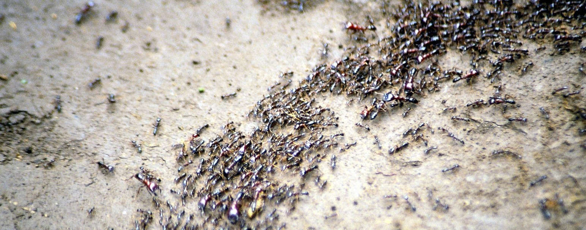

### Einordnung

heuristische Optimierung..
<br>
randomisiert
<br>
Schwarmintelligenz...
<br>

### Geschichte
### Arten von Ameisenalgorythmen
### Anwendungsfälle

### Herkunft 
{#id .class width=50% height=10%}


```{r ant, echo=FALSE}
#library(imager)
#im <- load.image("images/Safari_ants_small.png")
#plot(im, yaxt='n', xaxt='n') 

```
```


